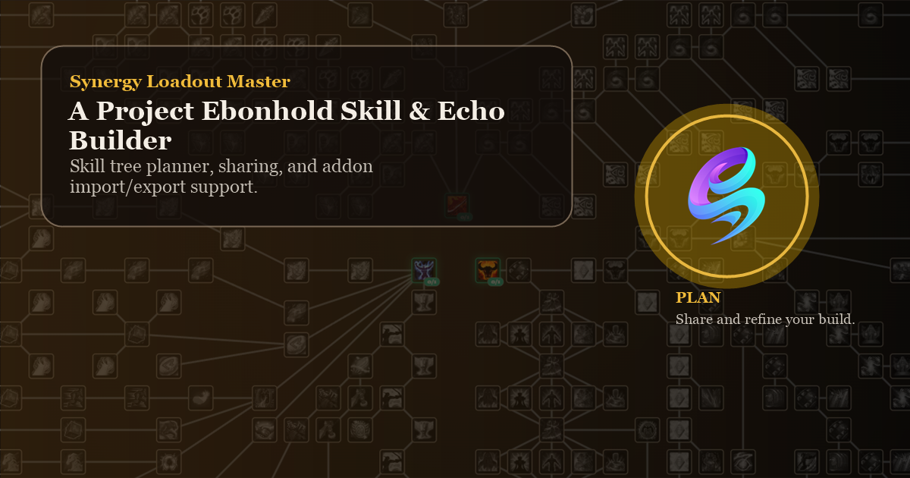

# Synergy Loadout Master

Proprietary Project Ebonhold build planning and loadout sharing website.

## Overview

This repository contains the public website build for **Synergy Loadout Master**.

Synergy Loadout Master is designed to help players plan and share Project Ebonhold builds outside the game while staying close to the in-game layout and addon workflows.

Public website sections:

- `Home`
- `Skill Tree`
- `Echo Builder / Planner`

## Public Features

### Skill Tree

- Plan your skill tree route with the current Soul Ash budget
- View skill tooltips and rank descriptions
- Import and export website strings
- Export addon-compatible loadout strings

### Builder / Planner

- `Planner` mode for Echo planning and stack management
- `Builder` mode for EchoArchitect-style profile creation
- Echo filtering by rarity, class, blacklist state, weight, and buckets
- EchoArchitect profile import and export
- In-browser calculation of dynamic Echo values

### Stat Import

The website supports stat imports for Echo calculations through the included WoW addon:

- [SynStatExport](https://github.com/SypherRed/SynStatExport)

This addon exports a stat string that can be imported into the website so formula-based Echo values can be previewed more accurately.

## Notes

- During game updates, the live Project Ebonhold tree or Echo data may temporarily differ from the website until the extracted data is updated.

## Ownership and Usage

This project is proprietary.

Use of the published website for its intended purpose is allowed.

The source, assets, layout, and functionality of the project may not be copied, modified, redistributed, republished, or reused without prior written permission.

See [LICENSE](https://github.com/SypherRed/syn_loadout-master/blob/main/LICENSE) for details.
